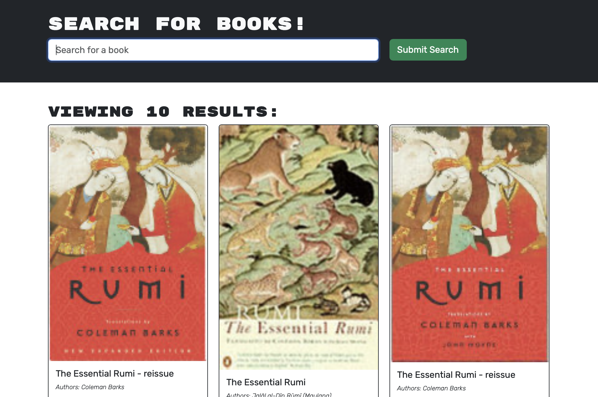
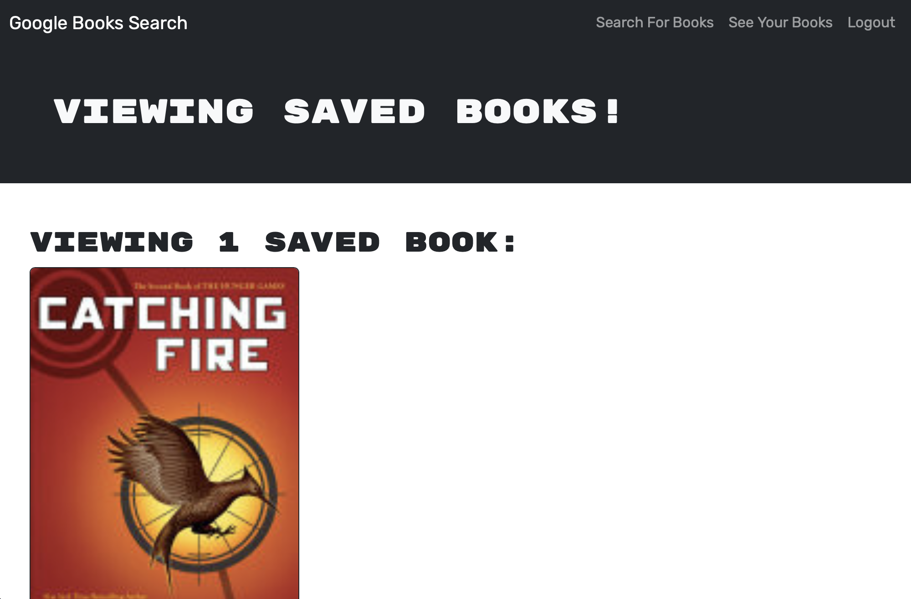

# Book Search Engine

## Description
An app utilising GraphQL API built using the MERN stack. Users are able to search and save a list of their favourite books on their profile.
## Table of Contents
- [Installation](#installation)
- [Usage](#usage)
- [License](#license)
- [Screenshots](#screenshots)
- [Contributors](#Contributors)
- [Questions](#questions)
## Installation
This can be installed onto your local machine for development.
1. Clone the repo
2. Navigate to the directory
3. Run the following commands:
- npm i
- npm run develop
## Usage
Navigate to the URL(s) provided in the console.
## License
      This project is licensed under the MIT license.
## Screenshots

## Contributors
 - [@alvin-est](https://github.com/alvin-est)
## Questions
If you have any questions, please contact me at [contact@alvin-the.dev](mailto:contact@alvin-the.dev). You can also find me on GitHub at [@alvin-est](https://github.com/alvin-est).  
